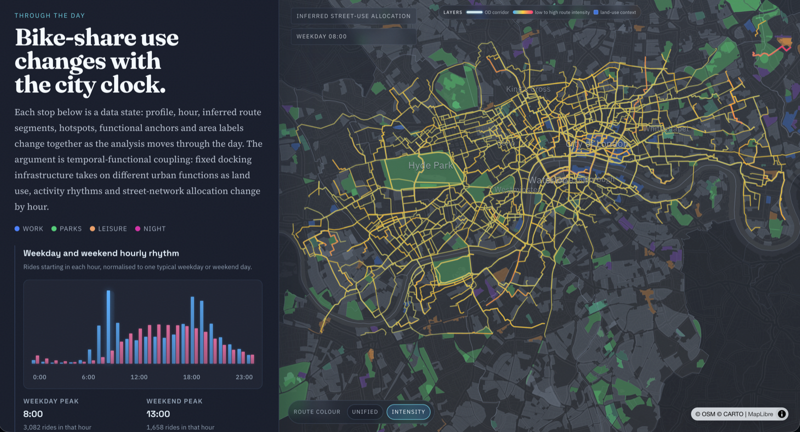

# How London Borrows Its Bikes

**Santander Cycles is a fixed docking network, but the role it plays in London changes by hour.** This project uses 2025 bike-share records to read that network as a temporal layer of urban accessibility: the same stations and streets are reweighted by commuting peaks, park use, visitor movement and the night-time economy.

[Live website](https://jameslemon2002.github.io/casa_viz_groupwork/) · [Repository](https://github.com/jameslemon2002/casa_viz_groupwork) · Group 20: Rong Zhao, Zhuohang Duan, Dailing Wu



## The Question

Bike-share maps often show where demand is high. This project asks a different question: **what urban function does the same bike-share system perform at different times of day?** Morning routes pull towards rail terminals and the employment core. Midday movement becomes shorter and more mixed. Weekend afternoons attach more strongly to parks and visitor districts. Late evening demand becomes smaller, but it does not disappear; it reorganises around central social and riverfront geographies.

The study area is the operational Santander Cycles docking footprint in inner and central London, not all of Greater London. The maps therefore describe the geography of a docked bike-share system, rather than London cycling as a whole.

## What The Story Does

The website is built as a guided map story followed by a free exploration tool. In the guided sequence, scrolling changes the profile, hour, inferred route layer, land-use context and area labels together. Each stop is treated as a data state rather than as a decorative map frame.

The final Route Lens section lets readers choose a profile and hour, switch route and context layers, and inspect specific inferred OD corridors. This separates the main argument from detailed exploration: the story explains the daily regimes, while the lens lets users test individual routes and local contexts.

## From Trips To Street Use

The source data is 2025 TfL Santander Cycles usage statistics and BikePoint station metadata. After matching station records and filtering invalid trips, the pipeline retains **8,846,143 trips** across **797 stations**.

The route layer is an inferred street-use allocation, not GPS traces. OD pairs are assigned to an OpenStreetMap-derived street graph with **337,680 nodes** and **359,397 edges**. The routing model uses four alternative routes, a detour limit of 1.55, distance-decay alpha 3.2, stochastic jitter 0.18 and assignment seed 2025. Route intensity is displayed on one global visual scale across time slices so quiet hours are not made artificially bright.

Spatial context comes from OSM and Overpass features for land use, POI classes, greenspaces and the service-area street network. Water features are excluded from the contextual layer because the analysis focuses on land-based activity around the bike-share network.

## Data, Code And Reproducibility

The repository includes the checked-in frontend, processing scripts and built data used by the deployed site.

Key folders:

- `src/`: React, MapLibre and deck.gl visualisation code.
- `scripts/`: data fetching, cleaning, routing and aggregation scripts.
- `public/data/`: data loaded by the GitHub Pages site.
- `data/processed/`: processed analysis outputs used to build the public data.
- `public/docs/`: Project Info and Methodology Summary PDFs.

The submitted output zip excludes empty raw/interim placeholder folders. Source data links and rebuild commands are documented here so the workflow remains traceable without packaging large raw downloads.

To run locally:

```bash
npm install
npm run dev -- --host 127.0.0.1 --port 5174
```

Open `http://127.0.0.1:5174/`.

To build:

```bash
npm run build
```

To rebuild the main data products after source-data changes:

```bash
npm run data:build:stations
npm run data:trips:annual
npm run data:build:boroughs
npm run data:build:story
npm run data:build:hourly
npm run data:build:temporal
npm run data:build:regimes
npm run data:fetch:street-network
npm run data:fetch:greenspaces
npm run data:build:route-flows
npm run data:optimize:route-flows
npm run data:build:functional-composition
npm run data:build:route-concentration
npm run build
```

## Libraries And Deployment

Main web and spatial visualisation libraries:

- React: <https://react.dev/>
- Vite: <https://vite.dev/>
- TypeScript: <https://www.typescriptlang.org/>
- MapLibre GL JS: <https://maplibre.org/maplibre-gl-js/docs/>
- deck.gl: <https://deck.gl/>
- csv-parse: <https://csv.js.org/parse/>

GitHub Pages is deployed from `main` through `.github/workflows/deploy-pages.yml`. Both `/` and `/map-review` serve the canonical story page.

## Method And References

The project methodology is summarised in the website appendix and in [`public/docs/Methodology_Summary_Group20.pdf`](public/docs/Methodology_Summary_Group20.pdf). The Project Info file is available at [`public/docs/Project_Info_Group20.pdf`](public/docs/Project_Info_Group20.pdf).

Core references and sources:

- O'Brien, Cheshire and Batty (2014), bicycle sharing data as evidence for sustainable transport systems: <https://doi.org/10.1016/j.jtrangeo.2013.06.007>
- Fishman (2016), bike-share literature review: <https://doi.org/10.1080/01441647.2015.1033036>
- Faghih-Imani et al. (2014), bike-share flows and land-use / urban form: <https://doi.org/10.1016/j.jtrangeo.2014.01.013>
- TfL Santander Cycles usage statistics: <https://cycling.data.tfl.gov.uk/>
- OpenStreetMap and Overpass API context layers.
